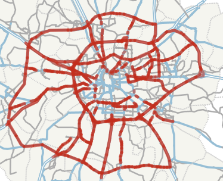
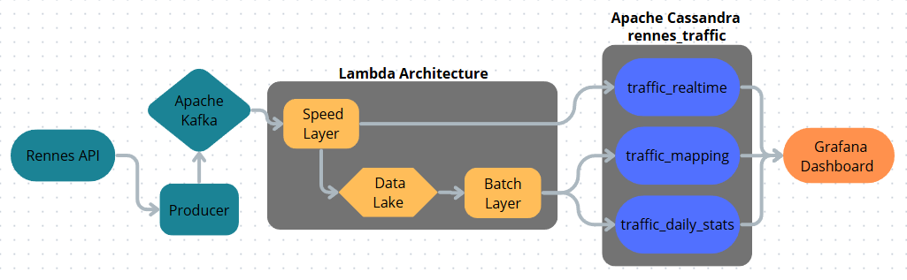
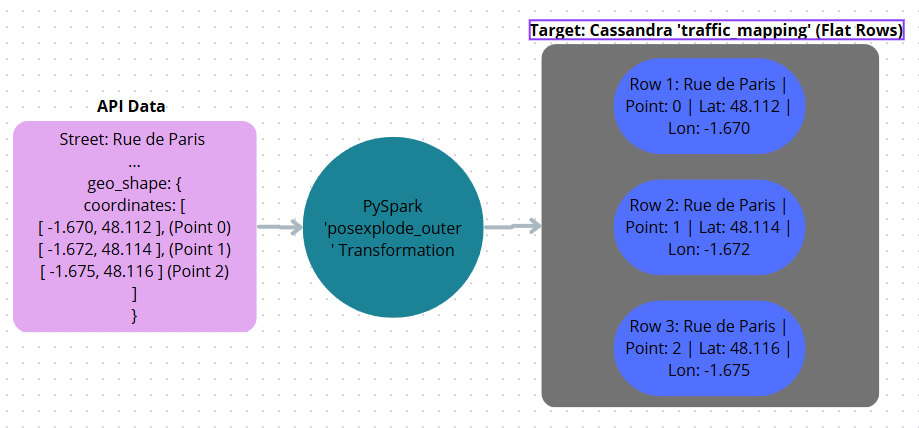
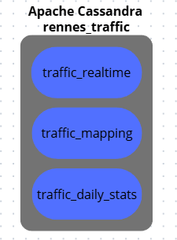

# 🚗 Rennes Real-Time Traffic & Lambda Architecture 🚗

## Introduction and Context
We need to process traffic information in seconds, but we also need our calculations to be 100% accurate over long periods. We implemented a **Lambda Architecture**, a data processing design that splits the pipeline into two separate paths:
*   **The Speed Layer:** Processes the real time data stream as soon as it arrives, giving immediate results based on the newest data.
*   **The Batch Layer:** Processes all the data in batches, looking at the entire history to calculate accurate trends.

### Selected Data
We extract data from the official [Rennes Métropole API](https://data.rennesmetropole.fr/explore/dataset/etat-du-trafic-en-temps-reel), which provides a stream of the city's traffic conditions. We want to achieve two different goals:
1. Show a real time live map where streets are colored based on their current traffic status (RED for 'congested', GREEN for 'freeFlow').
2. Calculate historical trends, specifically the average daily speed for every street over a 24 hour period. (In this case, we perform the calculation every 9 minutes, since, if we were to actually do this, our system would have to be running 24 hours a day, but let’s just say it’s one day)

---

## Architecture & Data Pipeline

### 1. Data Ingestion (Producer)
A Python script acts as the data extractor. It connects to the official API using an HTTP GET request. Since the API updates every 3 minutes, the script loops tothe newest data and transmits it directly to our Apache Kafka broker.

### 2. Speed Layer (Structured Streaming)
This layer handles events exactly as they arrive using PySpark in Structured Streaming mode. 
*   It extracts essential fields and translates French column names (`vitesse_max` $\rightarrow$ `max_speed`, `denomination` $\rightarrow$ `street_name`).
*   Dual Output: It writes the processed data into a Cassandra database for immediate visualizations, and simultaneously archives all historical events into a local Data Lake.

### 3. The Data Lake
Acts as cold storage. It saves the stream as compressed Parquet files, systematically organized into partitioned folders (`date_partition`)

### 4. Batch Layer
Runs automatically every 9 minutes (Let's imagine it's a full day) via a PySpark script, reading directly from the Data Lake instead of Kafka. It performs two tasks:
*   Geographic Flattening: Uses the `posexplode` Spark transformation to flatten the nested JSON array (`geo_shape`), creating a completely new row for every individual GPS point. This was delegated to the Batch Layer to prevent crashing the Speed Layer's memory.
*   Daily Statistics: Groups the historical data by street and date to compute the average daily speed.

---

## Data Storage Structuring using Cassandra
We implemented three separate tables within the `rennes_traffic` to support visualization rendering without full table scans:

| Table Name | Target Layer | Partition & Clustering Keys | Purpose |
| :--- | :--- | :--- | :--- |
| **`traffic_realtime`** | Speed Layer | `street_name` / `date_time` (DESC) | Continuously stores the most recent speed and traffic status. Designed to return the current state instantly. |
| **`traffic_mapping`** | Batch Layer | `street_name` / `date_time`, `point_order` | Stores the flattened GPS points to reconstruct the exact geographic line of streets point by point. |
| **`traffic_daily_stats`** | Batch Layer | `street_name` / `date_partition` | Stores historical data calculated by grouping records to extract the average speed over a 9 minutes period (Let's imagine it's a full day). |

---

## Data Visualization using Grafana
We connected Grafana to our Cassandra database

---

> **Advanced Big Data Project**
> **Authors:** ARAÚJO Joao, CÁCERES Alejandro  